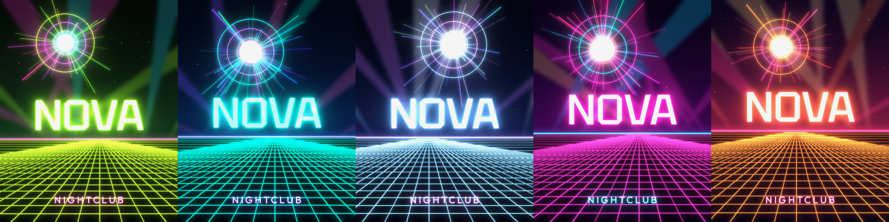

# Nightclub Nova: 2D image generator

Makes neon synthwave poster art for Nightclub Nova. Each image has a night sky with stars, a glowing "nova" burst, club light beams, a perspective grid floor and neon title text. The same seed always produces the same image.



## Setup

```bash
pip install -r requirements.txt
```

## Usage

```bash
python generate.py                                    # one random poster -> output/
python generate.py --seed 42 --palette magenta        # reproducible, fixed palette
python generate.py --count 10                         # a batch of variations
python generate.py --size 1920x1080 --subtitle "FRI 10PM"   # landscape event banner
python generate.py --title "NOVA" --subtitle "LADIES NIGHT" --out flyers/
```

| Option | Default | Description |
|---|---|---|
| `--seed` | random | Seed for the first image; the rest of a batch use seed+1, seed+2, … |
| `--count` | 1 | Number of images to generate |
| `--palette` | random | `acid`, `cyber`, `ice`, `magenta`, `sunset` |
| `--size` | `1080x1350` | `WIDTHxHEIGHT` in pixels (default is an Instagram portrait) |
| `--title` / `--subtitle` | `NOVA` / `NIGHTCLUB` | The text on the image |
| `--out` | `output` | Output directory |

The fonts in `fonts/` (Tektur, Outfit) are under the SIL Open Font License.

## Bar sprite

`bar.py` draws one isometric bar set: a front counter, an open gap for the bartender, and a back bar with a glowing glass rack, lit bottle displays and bottles. The sprite in `sprites/bar_set.png` has a transparent background. Sets are built so you can place them side by side to make a longer bar, as in `sprites/bar_x3_preview.png`.

```bash
python bar.py              # writes sprites/bar_set.png and previews
python bar.py --scale 2    # double resolution
```
